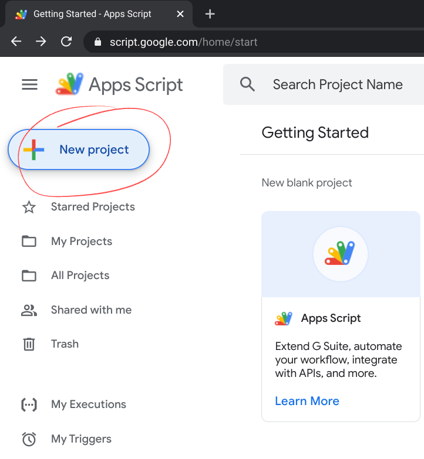
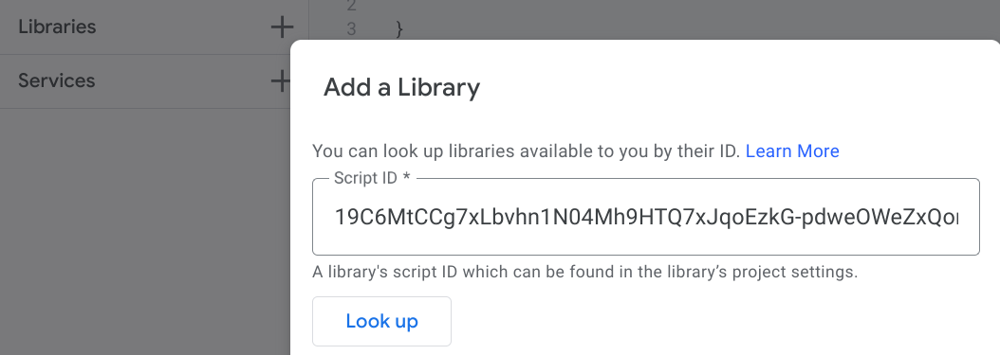

# DownloadPhotosFromTadpoles
Download photos and videos from Tadpoles into your Google Drive account

# How to set-up
1. Create a new project at https://script.google.com

1. Add a Library with script id: `19C6MtCCg7xLbvhn1N04Mh9HTQ7xJqoEzkG-pdweOWeZxQom6pqTryaBH`
